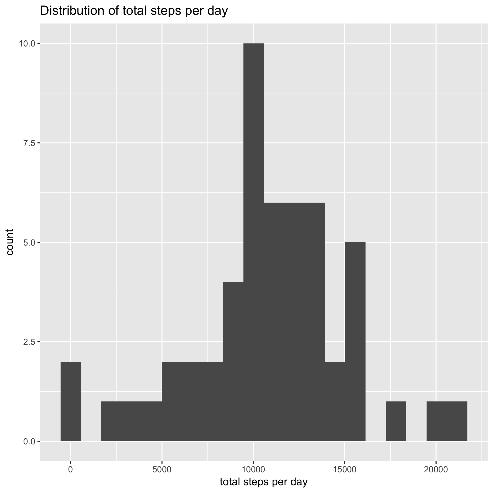
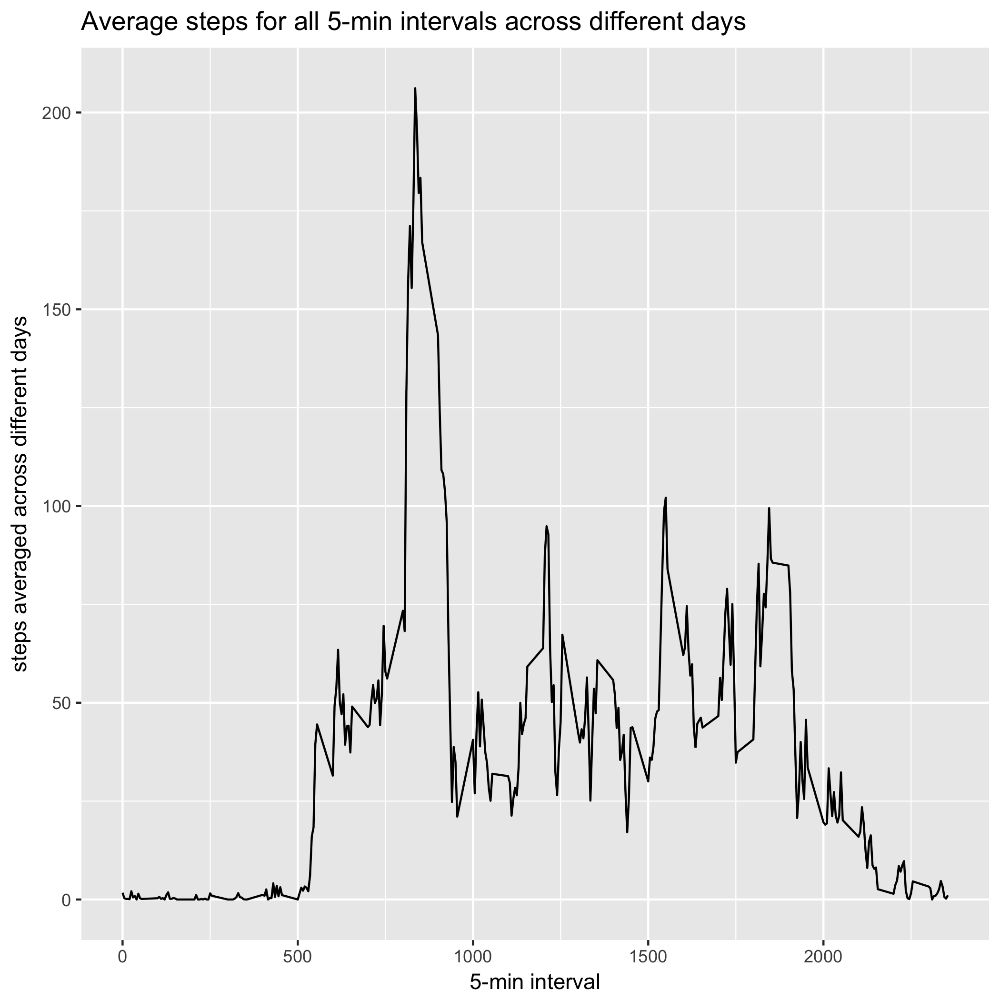
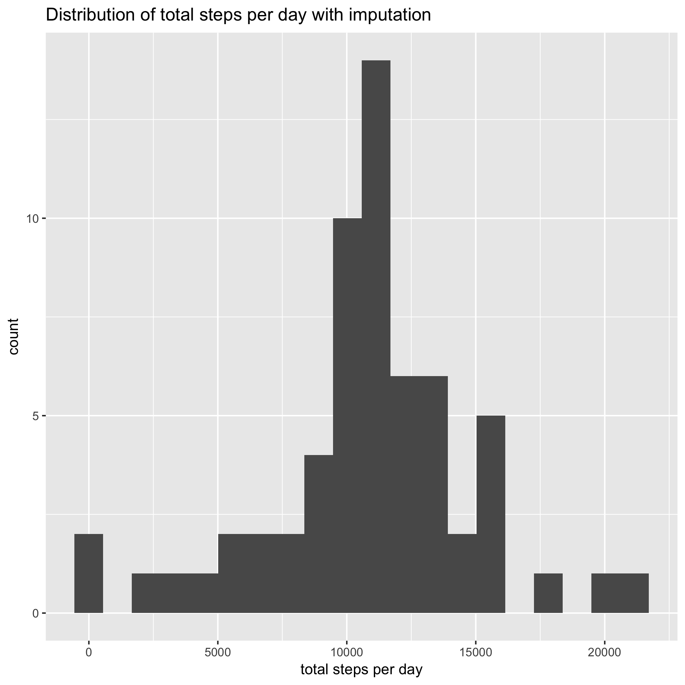
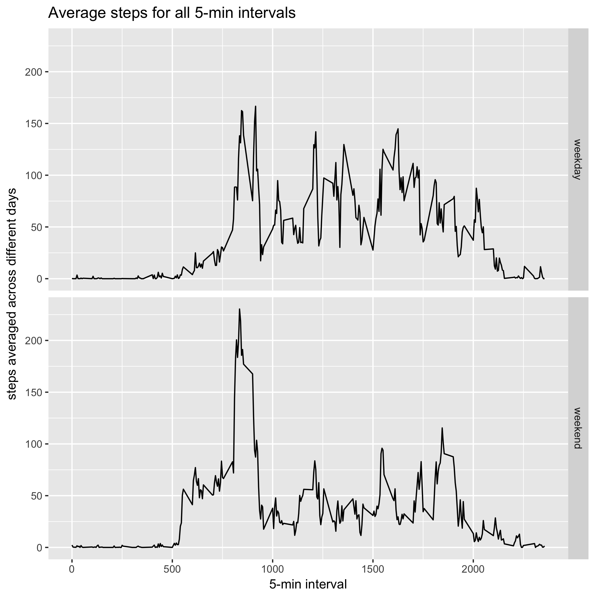

---
output:
  pdf_document: default
  html_document: default
---

# Load necessary packages 

```{r}
library(readr)
library(dplyr)
library(tidyr)
library(ggplot2)
```

# Loading and preprocessing the data 

```{r}
setwd("/Users/chengliangdong/Desktop/Coursera/R/reproducibleResearch/project1/")

if (!file.exists("active.zip")) {
  download.file("https://d396qusza40orc.cloudfront.net/repdata%2Fdata%2Factivity.zip", destfile = "active.zip")
}

if (!file.exists("activity.csv")) {
  unzip("active.zip", exdir = ".")
}

if (!exists("activityData")) {
  activityData <- read_csv("activity.csv", col_names = TRUE)
}
```

1. Take a summary of the data tells us that only steps have missing values
```{r}
summary(activityData)
```
```
     steps             date               interval         weekday     
 Min.   :  0.00   Min.   :2012-10-01   Min.   :   0.0   weekday: 4608  
 1st Qu.:  0.00   1st Qu.:2012-10-16   1st Qu.: 588.8   weekend:12960  
 Median :  0.00   Median :2012-10-31   Median :1177.5                  
 Mean   : 37.38   Mean   :2012-10-31   Mean   :1177.5                  
 3rd Qu.: 12.00   3rd Qu.:2012-11-15   3rd Qu.:1766.2                  
 Max.   :806.00   Max.   :2012-11-30   Max.   :2355.0                  
 NA's   :2304   
```


2. Which days have missing value, turns out that only 8 days have steps to be missing for all observations

```{r}
activityMissingByDay = activityData %>% 
  filter(is.na(steps)) %>%
  group_by(date) %>%
  summarize(stepsMissing = n()) 

activityMissingByDay
```
```
# A tibble: 8 x 2
        date stepsMissing
      <date>        <int>
1 2012-10-01          288
2 2012-10-08          288
3 2012-11-01          288
4 2012-11-04          288
5 2012-11-09          288
6 2012-11-10          288
7 2012-11-14          288
8 2012-11-30          288
```

# What is mean total number of steps taken per day? 

1. Calculate the total number of steps taken per day

```{r}
activityData %>% 
  filter(!is.na(steps)) %>%
  group_by(date) %>%
  summarise(totalSteps = sum(steps)) 
```

```
# A tibble: 53 x 2
         date totalSteps
       <date>      <int>
 1 2012-10-02        126
 2 2012-10-03      11352
 3 2012-10-04      12116
 4 2012-10-05      13294
 5 2012-10-06      15420
 6 2012-10-07      11015
 7 2012-10-09      12811
 8 2012-10-10       9900
 9 2012-10-11      10304
10 2012-10-12      17382
# ... with 43 more rows
```

2. Make a histogram of the total number of steps taken each day

```{r}
activityData %>% 
  filter(!is.na(steps)) %>%
  group_by(date) %>%
  summarise(totalSteps = sum(steps)) %>%
  ggplot(aes(x = totalSteps)) +
    geom_histogram(bins = 20) +
    xlab("total steps per day") +
    ggtitle("Distribution of total steps per day") 
```
<!-- -->

3. Calculate and report the mean and median of the total number of steps taken per day

```{r}
activityData %>% 
  filter(!is.na(steps)) %>%
  group_by(date) %>%
  summarise(totalSteps = sum(steps)) %>%
  mutate(meanStep = mean(totalSteps), 
         medianStep = median(totalSteps))
```

```
# A tibble: 53 x 4
         date totalSteps meanStep medianStep
       <date>      <int>    <dbl>      <int>
 1 2012-10-02        126 10766.19      10765
 2 2012-10-03      11352 10766.19      10765
 3 2012-10-04      12116 10766.19      10765
 4 2012-10-05      13294 10766.19      10765
 5 2012-10-06      15420 10766.19      10765
 6 2012-10-07      11015 10766.19      10765
 7 2012-10-09      12811 10766.19      10765
 8 2012-10-10       9900 10766.19      10765
 9 2012-10-11      10304 10766.19      10765
10 2012-10-12      17382 10766.19      10765
# ... with 43 more rows
```

# What is the average daily activity pattern? 

1. Make a time series plot of the 5-minute interval and the average number of steps taken, averaged across all days (y-axis)

```{r}
activityData %>%
  filter(!is.na(steps)) %>% 
  group_by(interval) %>%
  summarise(avereageStep = mean(steps)) %>%
  ggplot(aes(x = interval, y = avereageStep)) +
    geom_line() +
    xlab("5-min interval") +
    ylab("steps averaged across different days") +
    ggtitle("Average steps for all 5-min intervals across different days")
```
<!-- -->

2. Which 5-minute interval, on average across all the days in the dataset, contains the maximum number of steps?

```{r}
activityData %>%
  filter(!is.na(steps)) %>% 
  group_by(interval) %>%
  summarise(averageStep = mean(steps)) %>%
  filter(averageStep == max(averageStep))
```

```
# A tibble: 1 x 2
  interval averageStep
     <int>       <dbl>
1      835    206.1698
```

# Imputing missing values 

1. Calculate and report the total number of missing values in the dataset 

```{r}
activityData %>%
  filter(is.na(steps)) %>%
  nrow()
```
```
[1] 2304
```
2. Devise a strategy for filling in all of the missing values in the dataset. The strategy does not need to be sophisticated. For example, you could use the mean/median for that day, or the mean for that 5-minute interval, etc.

The strategy that I take is to use average steps for each interval to impute the missing values.

First, I compute average steps for each interval
```{r}
averageStepByInterval = activityData %>%
  filter(!is.na(steps)) %>%
  group_by(interval) %>%
  summarise(averageStepByInterval = mean(steps))
```
  
3. Create a new dataset that is equal to the original dataset but with the missing data filled in

Second, I use the average steps from last step to impute the missing values 
```{r}
activityDataImpute = activityData %>%
  inner_join(averageStepByInterval, by = "interval") %>%
  transmute(steps = ifelse(is.na(steps), averageStepByInterval, steps), 
            date = date,
            interval = interval)
```

4. Make a histogram of the total number of steps taken each day and Calculate and report the mean and median total number of steps taken per day. Do these values differ from the estimates from the first part of the assignment? What is the impact of imputing missing data on the estimates of the total daily number of steps?

```{r}
activityDataImpute %>% 
  filter(!is.na(steps)) %>%
  group_by(date) %>%
  summarise(totalSteps = sum(steps)) %>%
  ggplot(aes(x = totalSteps)) +
  geom_histogram(bins = 20) +
  xlab("total steps per day") +
  ggtitle("Distribution of total steps per day with imputation") 
```

<!-- -->

5. Calculate and report the mean and median of the total number of steps taken per day

```{r}
activityDataImpute %>% 
  filter(!is.na(steps)) %>%
  group_by(date) %>%
  summarise(totalSteps = sum(steps)) %>%
  mutate(meanStep = mean(totalSteps), 
         medianStep = median(totalSteps))
```
```
# A tibble: 61 x 4
         date totalSteps meanStep medianStep
       <date>      <dbl>    <dbl>      <dbl>
 1 2012-10-01   10766.19 10766.19   10766.19
 2 2012-10-02     126.00 10766.19   10766.19
 3 2012-10-03   11352.00 10766.19   10766.19
 4 2012-10-04   12116.00 10766.19   10766.19
 5 2012-10-05   13294.00 10766.19   10766.19
 6 2012-10-06   15420.00 10766.19   10766.19
 7 2012-10-07   11015.00 10766.19   10766.19
 8 2012-10-08   10766.19 10766.19   10766.19
 9 2012-10-09   12811.00 10766.19   10766.19
10 2012-10-10    9900.00 10766.19   10766.19
# ... with 51 more rows
```

# Are there differences in activity patterns between weekdays and 

1. Create a new factor variable in the dataset with two levels – "weekday" and "weekend" indicating whether a given date is a weekday or weekend day.

```{r}
activityDataImpute = activityDataImpute %>%
  mutate(weekday = factor(ifelse(weekdays(date) != "Sunday" & weekdays(date) != "Saturday", "weekend", "weekday")))
```
  
2. Make a panel plot containing a time series plot of the 5-minute interval (x-axis) and the average number of steps taken, averaged across all weekday days or weekend days (y-axis)

```{r}
activityDataImpute %>%
  group_by(interval, weekday) %>%
  summarise(averageStepByInterval = mean(steps)) %>%
  ggplot(aes(x = interval, y = averageStepByInterval)) +
    geom_line() +
    facet_grid(weekday ~ .) +
    xlab("5-min interval") +
    ylab("steps averaged across different days") +
    ggtitle("Average steps for all 5-min intervals")

```
<!-- -->
